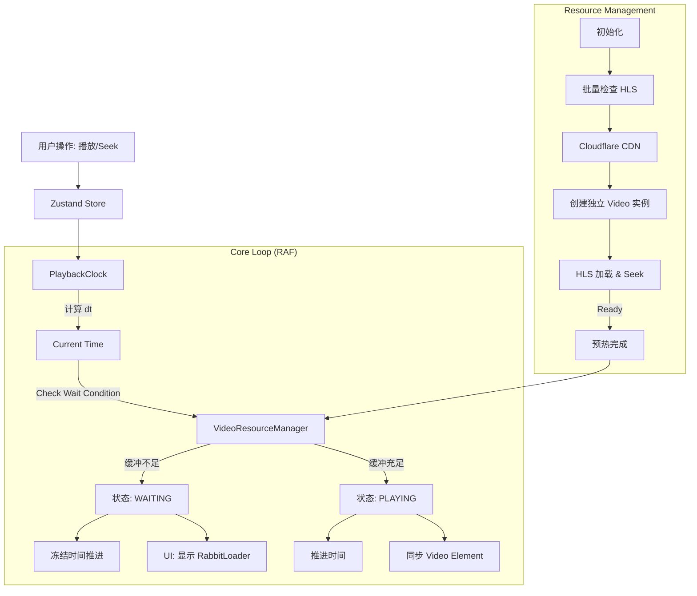

# 视频编辑器 V3 播放架构与缓冲策略技术文档

本文档详细描述了 HopRabbit AI 视频编辑器（V3版本）的底层播放架构、资源管理策略及缓冲优化逻辑。该架构旨在解决多 Clip 切换时的卡顿、黑屏及音画同步问题，遵循"治标治本"的设计理念。

---

## 目录

1. [核心架构设计](#1-核心架构设计)
2. [关键实现逻辑](#2-关键实现逻辑)
3. [核心模块 API 详解](#3-核心模块-api-详解)
4. [状态机与生命周期](#4-状态机与生命周期)
5. [数据流转图](#5-数据流转图)
6. [关键代码路径](#6-关键代码路径)
7. [异常处理与降级](#7-异常处理与降级)
8. [配置参数](#8-配置参数)
9. [调试指南](#9-调试指南)
10. [性能指标](#10-性能指标)
11. [已知问题与优化方向](#11-已知问题与优化方向)

---

## 1. 核心架构设计

编辑器采用 **三层分离架构**，将资源管理、时间控制与 UI 渲染彻底解耦。

### 1.1 模块职责划分

| 模块 | 类型 | 文件路径 | 职责 |
| :--- | :--- | :--- | :--- |
| **VideoResourceManager** | 全局单例 | `services/VideoResourceManager.ts` | 视频 DOM 元素管理、HLS 实例生命周期、预加载、缓冲状态监控、URL 签名解析 |
| **PlaybackClock** | 全局单例 | `services/PlaybackClock.ts` | 基于 RAF 的高精度时钟，驱动播放进度，处理"暂停-等待"逻辑 |
| **VideoCanvasV3** | UI 组件 | `components/canvas/VideoCanvasV3.tsx` | 纯视口渲染层，布局计算、画面合成、Store 状态同步 |
| **VideoClipRenderer** | UI 子组件 | `components/canvas/VideoCanvasV3.tsx` | 单个 Clip 渲染容器，Video 元素挂载、CSS Transform |

### 1.2 依赖关系

```
┌─────────────────────────────────────────────────────────────┐
│                      VideoCanvasV3                          │
│  (React Component - 渲染层)                                  │
│  - 监听 Store 状态                                           │
│  - 监听 PlaybackClock 时间                                   │
│  - 渲染 VideoClipRenderer 子组件                             │
└─────────────────┬───────────────────────────────────────────┘
                  │ 订阅
                  ▼
┌─────────────────────────────────────────────────────────────┐
│                      PlaybackClock                          │
│  (全局单例 - 时间控制层)                                      │
│  - RAF 驱动时间推进                                          │
│  - waitCondition 检查                                        │
│  - 通知所有 listeners                                        │
└─────────────────┬───────────────────────────────────────────┘
                  │ 调用
                  ▼
┌─────────────────────────────────────────────────────────────┐
│                   VideoResourceManager                       │
│  (全局单例 - 资源管理层)                                      │
│  - 管理 clipVideos Map                                       │
│  - 管理 hlsAvailability 缓存                                 │
│  - 创建/销毁 Video 元素和 HLS 实例                            │
└─────────────────────────────────────────────────────────────┘
```

---

## 2. 关键实现逻辑

### 2.1 "治标治本"预热策略 (Aggressive Preheating)

为了消除 Clip 切换时的加载延迟，V3 放弃了"懒加载"策略，改为**全量预热**。

#### 2.1.1 HLS 源解析优化

```typescript
// 1. 批量检查 HLS 可用性（获取 Cloudflare CDN 直连地址）
await videoResourceManager.batchCheckHlsAvailability(assetIds);

// 2. 内部实现：调用后端 /api/assets/{assetId}/hls-status
// 返回: { available, playlistUrl, isCloudflare, cloudflareUid }

// 3. playlistUrl 示例：
// Cloudflare: https://videodelivery.net/{uid}/manifest/video.m3u8
// 本地回退:   http://localhost:8000/api/assets/hls/{assetId}/playlist.m3u8
```

**关键优化**：优先使用 `playlistUrl`（Cloudflare CDN 直连），绕过后端 Proxy，大幅降低 TTFB。

#### 2.1.2 Clip 维度资源隔离

```typescript
// 每个 Clip 创建独立的 Video 元素（即便引用同一个 Asset）
const clipVideo = videoResourceManager.createVideoForClip(
  clipId,      // 唯一标识
  assetId,     // 素材 ID
  inPoint,     // 入点（秒）
  outPoint,    // 出点（秒）
  isBRoll      // 是否 B-Roll
);
```

**为什么不复用 Video 标签？**
- 复用导致 `seek` 时画面跳变
- 复用导致缓冲区被其他 Clip 覆盖
- 复用导致 HLS 分片请求冲突

#### 2.1.3 视频源类型判断 (HLS vs MP4)

`getSourceType()` 方法根据以下规则决定使用 HLS 还是 MP4：

| 场景 | 视频源类型 | 原因 |
| :--- | :--- | :--- |
| 主视频（Cloudflare Stream）| HLS | Cloudflare 只提供 HLS 流 |
| B-Roll（Pexels 下载）| MP4 | Pexels 视频是标准 H.264，直接 MP4 代理播放 |
| HLS 不可用 | MP4 | 回退到后端 MP4 代理 |

```typescript
// 决策逻辑
getSourceType(assetId: string, clipDuration: number, isBRoll: boolean): VideoSourceType {
  const cachedHls = this.hlsAvailability.get(assetId);
  
  // 1. HLS 明确可用 → 使用 HLS
  if (cachedHls?.available && cachedHls.playlistUrl) {
    return 'hls';
  }
  
  // 2. B-Roll 或 HLS 不可用 → 使用 MP4
  if (isBRoll || (cachedHls && !cachedHls.available)) {
    return 'mp4';
  }
  
  // 3. 默认 HLS
  return 'hls';
}
```

#### 2.1.4 严格的就绪门槛

预热完成条件（**所有条件必须同时满足**）：

| 条件 | 检查方式 | 说明 |
| :--- | :--- | :--- |
| HLS 实例挂载 | `hls.attachMedia(element)` | HLS.js 已绑定到 Video 元素 |
| 元数据加载 | `loadedmetadata` 事件 | 视频时长、分辨率等信息可用 |
| Seek 到入点 | `video.currentTime = inPoint` | 定位到 Clip 的起始帧 |
| Seek 完成 | `seeked` 事件 | 浏览器完成 seek 操作 |
| 缓冲充足 | `status === 'ready'` | 缓冲区 ≥ bufferThreshold (2s) |

### 2.2 播放控制与时钟同步

#### 2.2.1 时钟驱动模型

播放**不再由** `<video>.play()` 驱动，而是由 `PlaybackClock` 统一调度。

```typescript
// PlaybackClock RAF 循环核心逻辑
private tick = () => {
  if (!this._isPlaying) return;
  
  const now = performance.now();
  const dt = now - this._lastTickTime;
  
  // 1. 检查 waitCondition（是否需要等待缓冲）
  if (this._waitCondition && this._waitCondition(this._currentTimeMs)) {
    this._isWaiting = true;
    this.notifyWaitingListeners(true);
    // 不推进时间，继续下一帧检查
    this._rafId = requestAnimationFrame(this.tick);
    return;
  }
  
  // 2. 恢复播放
  if (this._isWaiting) {
    this._isWaiting = false;
    this.notifyWaitingListeners(false);
  }
  
  // 3. 推进时间
  this._currentTimeMs += dt;
  this._lastTickTime = now;
  
  // 4. 通知所有监听者
  this.notifyListeners();
  
  // 5. 继续下一帧
  if (this._isPlaying) {
    this._rafId = requestAnimationFrame(this.tick);
  }
};
```

#### 2.2.2 Video 元素同步

```typescript
// VideoClipRenderer 中的同步逻辑
useEffect(() => {
  if (!clipVideo?.element || !isVisible) return;
  
  const video = clipVideo.element;
  const clipTimeMs = currentTimeMs - clip.start;
  const sourceTimeSec = msToSec(clip.sourceStart || 0) + msToSec(clipTimeMs);
  
  // 校准 video.currentTime（允许 0.1s 误差）
  if (Math.abs(video.currentTime - sourceTimeSec) > 0.1) {
    video.currentTime = sourceTimeSec;
  }
  
  // 同步播放状态
  if (isPlaying && video.paused) {
    video.play().catch(() => {});
  } else if (!isPlaying && !video.paused) {
    video.pause();
  }
}, [currentTimeMs, isPlaying, isVisible]);
```

### 2.3 智能缓冲等待 (Smart Buffering)

#### 2.3.1 Wait Condition 机制

```typescript
// VideoCanvasV3 中注册 waitCondition
playbackClock.setWaitCondition((timeMs) => {
  // 找到当前时间对应的 Clip
  const currentClip = videoClips.find(c => 
    timeMs >= c.start && timeMs < c.start + c.duration
  );
  
  if (!currentClip) return false;
  
  // 检查该 Clip 是否 ready
  const clipVideo = videoResourceManager.getClipVideo(currentClip.id);
  return clipVideo?.status !== 'ready';
});
```

#### 2.3.2 状态转换

```
PLAYING ──[waitCondition=true]──> WAITING
   ▲                                  │
   │                                  │
   └───[waitCondition=false]──────────┘
```

---

## 3. 核心模块 API 详解

### 3.1 VideoResourceManager

#### 3.1.1 类型定义

```typescript
interface ClipVideoState {
  clipId: string;
  assetId: string;
  element: HTMLVideoElement;
  src: string;
  sourceType: 'hls' | 'mp4';
  hls?: Hls;
  status: 'loading' | 'ready' | 'error';
  bufferedRanges: BufferedRange[];
  lastAccessTime: number;
  clipStartInAsset: number;  // 入点（秒）
  clipEndInAsset: number;    // 出点（秒）
  isBRoll: boolean;
}

interface VideoResourceConfig {
  maxActiveVideos: number;     // 最大活跃视频数（默认 10）
  preheatWindowSec: number;    // 预热窗口（秒）
  seekThreshold: number;       // seek 阈值（秒）
  bufferThreshold: number;     // 缓冲阈值（秒，默认 2）
  hlsThreshold: number;        // HLS 时长阈值（秒）
  debug: boolean;
}
```

#### 3.1.2 核心方法

| 方法 | 参数 | 返回值 | 说明 |
| :--- | :--- | :--- | :--- |
| `createVideoForClip` | clipId, assetId, inPoint, outPoint, isBRoll | ClipVideoState | 创建视频元素和 HLS 实例 |
| `getClipVideo` | clipId | ClipVideoState \| undefined | 获取 Clip 的视频状态 |
| `destroyClipVideo` | clipId | void | 销毁视频资源 |
| `checkHlsAvailability` | assetId | Promise\<boolean\> | 检查 HLS 可用性（异步） |
| `batchCheckHlsAvailability` | assetIds | Promise\<void\> | 批量检查 HLS 可用性 |
| `isHlsAvailable` | assetId | boolean | 同步获取 HLS 可用性（需先调用 check） |
| `getSourceType` | assetId, duration, isBRoll | 'hls' \| 'mp4' | 判断应使用的视频源类型 |
| `addEventListener` | id, listener | void | 注册事件监听器 |
| `removeEventListener` | id | void | 移除事件监听器 |
| `reset` | - | void | 销毁所有资源 |

#### 3.1.3 事件类型

```typescript
type VideoResourceEvent = {
  type: 'load-ready' | 'load-error' | 'buffer-update';
  clipId: string;
  [key: string]: unknown;
};
```

### 3.2 PlaybackClock

#### 3.2.1 核心属性

| 属性 | 类型 | 说明 |
| :--- | :--- | :--- |
| `currentTimeMs` | number (readonly) | 当前播放时间（毫秒） |
| `isPlaying` | boolean (readonly) | 是否正在播放 |
| `isWaiting` | boolean (readonly) | 是否等待缓冲 |

#### 3.2.2 核心方法

| 方法 | 参数 | 说明 |
| :--- | :--- | :--- |
| `play()` | - | 开始播放 |
| `pause()` | - | 暂停播放 |
| `seek(timeMs)` | timeMs: number | 跳转到指定时间 |
| `setWaitCondition(fn)` | fn: (timeMs) => boolean | 设置等待条件回调 |
| `addListener(id, fn)` | id, fn: (timeMs, isPlaying) => void | 添加时间监听器 |
| `removeListener(id)` | id: string | 移除时间监听器 |
| `addWaitingListener(id, fn)` | id, fn: (isWaiting) => void | 添加等待状态监听器 |
| `removeWaitingListener(id)` | id: string | 移除等待状态监听器 |
| `reset()` | - | 重置时钟状态 |

### 3.3 VideoCanvasV3

#### 3.3.1 内部状态

| State | 类型 | 说明 |
| :--- | :--- | :--- |
| `isInitialLoading` | boolean | 是否初始加载中 |
| `preheatProgress` | { done, total } | 预热进度 |
| `isWaitingBuffer` | boolean | 是否等待缓冲 |
| `containerSize` | { width, height } | 容器尺寸 |
| `zoom` | number | 缩放比例 |

#### 3.3.2 关键 Effects

| Effect 依赖 | 触发时机 | 作用 |
| :--- | :--- | :--- |
| `[videoClips, setIsVideoReady]` | 初始化 & clips 变化 | 执行预热流程 |
| `[videoClips, isInitialLoading]` | clips 动态变化 | 为新增 clips 创建视频元素 |
| `[setCurrentTime, setIsPlaying]` | 组件挂载 | 注册 PlaybackClock 监听器 |
| `[currentTime]` | 用户拖动时间轴 | Store -> Clock 同步 |
| `[isPlaying]` | 用户点击播放/暂停 | Store -> Clock 同步 |

---

## 4. 状态机与生命周期

### 4.1 视频资源状态机

```
                    ┌───────────────┐
                    │   (无资源)    │
                    └───────┬───────┘
                            │ createVideoForClip()
                            ▼
                    ┌───────────────┐
                    │   loading     │
                    └───────┬───────┘
                            │
            ┌───────────────┼───────────────┐
            │               │               │
            ▼               ▼               ▼
    ┌───────────┐   ┌───────────┐   ┌───────────┐
    │  loading  │   │   ready   │   │   error   │
    │ (缓冲中)  │   │  (可播放) │   │  (失败)   │
    └─────┬─────┘   └───────────┘   └─────┬─────┘
          │               ▲               │
          │               │               │
          └───────────────┘               │
            buffer 充足                    │
                                          ▼
                                  ┌───────────┐
                                  │ (重试/销毁)│
                                  └───────────┘
```

### 4.2 播放时钟状态机

```
                    ┌───────────────┐
                    │    PAUSED     │ ◄─── 初始状态
                    └───────┬───────┘
                            │ play()
                            ▼
                    ┌───────────────┐
         ┌─────────│   PLAYING     │─────────┐
         │         └───────┬───────┘         │
         │                 │                 │
         │ pause()         │ waitCondition   │ 到达结尾
         │                 │ = true          │
         ▼                 ▼                 ▼
 ┌───────────────┐ ┌───────────────┐ ┌───────────────┐
 │    PAUSED     │ │   WAITING     │ │    PAUSED     │
 └───────────────┘ └───────┬───────┘ └───────────────┘
                           │
                           │ waitCondition = false
                           │
                           ▼
                   ┌───────────────┐
                   │   PLAYING     │
                   └───────────────┘
```

### 4.3 组件生命周期

```
VideoCanvasV3 Mount
        │
        ├─► 1. 计算 videoClips (useMemo)
        │
        ├─► 2. 初始化预热 (useEffect)
        │       │
        │       ├─► batchCheckHlsAvailability()
        │       │
        │       ├─► 并行 createVideoForClip()
        │       │
        │       ├─► 并行等待 ready + seeked
        │       │
        │       └─► setIsInitialLoading(false)
        │
        ├─► 3. 注册 PlaybackClock 监听器 (useEffect)
        │
        ├─► 4. 注册 VideoResourceManager 事件 (useEffect)
        │
        └─► 5. 监听 videoClips 变化 (useEffect)
                │
                └─► 检测新增 clips → 创建视频元素
```

---

## 5. 数据流转图

### 5.1 整体数据流



### 5.2 HLS URL 解析流程

```
Frontend                          Backend                        Cloudflare
   │                                 │                              │
   │ checkHlsAvailable(assetId)      │                              │
   │ ────────────────────────────►   │                              │
   │                                 │                              │
   │                                 │  查询 asset.storage_path     │
   │                                 │  (cloudflare:{uid})          │
   │                                 │                              │
   │ { playlistUrl: "https://       │                              │
   │   videodelivery.net/{uid}/     │                              │
   │   manifest/video.m3u8" }       │                              │
   │ ◄────────────────────────────   │                              │
   │                                 │                              │
   │ HLS.loadSource(playlistUrl)    │                              │
   │ ─────────────────────────────────────────────────────────────► │
   │                                 │                              │
   │ ◄─────────────────────────────────────────────────────────────  │
   │                           m3u8 manifest                        │
   │                                 │                              │
   │ 请求 TS 分片                     │                              │
   │ ─────────────────────────────────────────────────────────────► │
```

### 5.3 时钟同步流程

```
Store (currentTime)          PlaybackClock              VideoClipRenderer
        │                          │                          │
        │  [用户拖动时间轴]         │                          │
        │ ──────────────────────► │                          │
        │  playbackClock.seek()   │                          │
        │                          │                          │
        │                          │ [RAF tick]               │
        │                          │ 计算新时间               │
        │                          │                          │
        │  [listener 回调]         │                          │
        │ ◄────────────────────── │                          │
        │  setCurrentTime()        │                          │
        │                          │                          │
        │                          │                          │
        │ [React 重渲染]            │                          │
        │ ──────────────────────────────────────────────────► │
        │                          │    currentTimeMs prop    │
        │                          │                          │
        │                          │  video.currentTime = x   │
        │                          │  video.play()            │
```

---

## 6. 关键代码路径

### 6.1 初始化加载

```
1. EditorPage 加载项目
   └── useEditorStore.loadProject(projectId)
       └── 加载 clips, tracks, assets

2. VideoCanvasV3 挂载
   └── useEffect (初始预热)
       ├── videoResourceManager.batchCheckHlsAvailability(assetIds)
       │   └── 调用 /api/assets/{id}/hls-status
       │       └── 缓存 { available, playlistUrl } 到 hlsAvailability Map
       │
       ├── 并行 createVideoForClip()
       │   ├── document.createElement('video')
       │   ├── new Hls({ ... })
       │   ├── hls.loadSource(playlistUrl)  // 优先用缓存的 Cloudflare URL
       │   └── hls.attachMedia(element)
       │
       └── 等待每个 clip 就绪
           ├── 监听 'ready' 事件 (status === 'ready')
           ├── video.currentTime = inPoint
           └── 等待 'seeked' 事件
```

### 6.2 播放流程

```
1. 用户点击播放
   └── setIsPlaying(true)
       └── useEffect 触发
           └── playbackClock.play()

2. PlaybackClock.play()
   └── _isPlaying = true
   └── requestAnimationFrame(tick)

3. tick() 循环
   ├── 检查 waitCondition
   │   └── 如果需要等待 → 通知 UI 显示 RabbitLoader
   │
   ├── 推进时间
   │   └── _currentTimeMs += dt
   │
   └── 通知监听者
       └── listener(timeMs, isPlaying)
           └── setCurrentTime(timeMs)
               └── React 重渲染
                   └── VideoClipRenderer 更新
                       └── video.currentTime = sourceTimeSec
```

### 6.3 Clip 切换

```
1. 时间推进到下一个 Clip 区间
   └── currentTime >= nextClip.start

2. VideoCanvasV3 重渲染
   └── videoClips.map() 计算 isVisible
       └── 当前 Clip: isVisible = true
       └── 下一个 Clip: isUpcoming = true (预热窗口内)

3. VideoClipRenderer 更新
   ├── 当前 Clip:
   │   └── isVisible + isPlaying → video.play()
   │
   └── 下一个 Clip:
       └── isUpcoming → video.currentTime = inPoint (提前 seek)

4. waitCondition 检查
   └── 如果下一个 Clip 未 ready → 暂停推进 → 显示 RabbitLoader
```

### 6.4 动态添加 B-Roll

```
1. BRollPanel 生成 B-Roll
   └── generateBRollClips()
       └── 后端创建 clips + assets

2. 轮询检测新增 clips
   └── loadClips()
       └── 更新 clips 状态

3. VideoCanvasV3 检测变化
   └── useEffect [videoClips, isInitialLoading]
       ├── 过滤出没有视频元素的 clips
       ├── batchCheckHlsAvailability()
       └── createVideoForClip()
```

---

## 7. 异常处理与降级

### 7.1 HLS 错误处理

```typescript
// VideoResourceManager 中的 HLS 错误处理
hls.on(Hls.Events.ERROR, (_, data) => {
  if (data.fatal) {
    switch (data.type) {
      case Hls.ErrorTypes.NETWORK_ERROR:
        // 网络错误：尝试恢复
        log('HLS 网络错误，尝试恢复:', clipId);
        hls.startLoad();
        break;
      case Hls.ErrorTypes.MEDIA_ERROR:
        // 媒体错误：尝试恢复
        log('HLS 媒体错误，尝试恢复:', clipId);
        hls.recoverMediaError();
        break;
      default:
        // 其他致命错误：销毁并标记失败
        log('HLS 致命错误:', clipId, data);
        state.status = 'error';
        this.emitEvent('load-error', clipId, { error: data });
        break;
    }
  }
});
```

### 7.2 降级策略

| 场景 | 检测方式 | 降级方案 |
| :--- | :--- | :--- |
| HLS 不可用 | `!Hls.isSupported()` | 使用原生 `<video src="">` + MP4 Proxy |
| Cloudflare 404 | HLS NETWORK_ERROR | 回退到后端 HLS Proxy |
| 视频加载超时 | 10s 无 canplay 事件 | 标记 error，继续播放其他 clips |
| 缓冲不足 | waitCondition = true | 暂停推进，显示 RabbitLoader |

### 7.3 内存管理

```typescript
// LRU 策略（待实现）
// 当 clipVideos.size > maxActiveVideos 时，销毁最久未访问的视频

private cleanupOldVideos() {
  if (this.clipVideos.size <= this.config.maxActiveVideos) return;
  
  const sorted = [...this.clipVideos.entries()]
    .sort(([, a], [, b]) => a.lastAccessTime - b.lastAccessTime);
  
  while (this.clipVideos.size > this.config.maxActiveVideos) {
    const [clipId, state] = sorted.shift()!;
    this.destroyClipVideo(clipId);
  }
}
```

---

## 8. 配置参数

### 8.1 VideoResourceManager 配置

| 参数 | 默认值 | 说明 |
| :--- | :--- | :--- |
| `maxActiveVideos` | 10 | 同时激活的最大视频数 |
| `preheatWindowSec` | 15 | 预热窗口（秒） |
| `seekThreshold` | 0.3 | seek 误差阈值（秒） |
| `bufferThreshold` | 2 | 缓冲充足阈值（秒） |
| `hlsThreshold` | 10 | 使用 HLS 的时长阈值（秒） |
| `debug` | NODE_ENV === 'development' | 是否输出调试日志 |

### 8.2 HLS.js 配置

```typescript
new Hls({
  enableWorker: true,           // 启用 Web Worker
  lowLatencyMode: false,        // 禁用低延迟模式（编辑器不需要）
  maxBufferLength: 30,          // 最大缓冲长度（秒）
  maxMaxBufferLength: 60,       // 绝对最大缓冲长度（秒）
});
```

### 8.3 预热窗口

```typescript
// VideoCanvasV3 中的预热窗口
const PREHEAT_WINDOW_MS = 2000;  // 2 秒

// 判断是否需要预热
const isUpcoming = !isVisible && 
  currentTime >= clip.start - PREHEAT_WINDOW_MS && 
  currentTime < clip.start;
```

---

## 9. 调试指南

### 9.1 日志前缀

| 前缀 | 来源 |
| :--- | :--- |
| `[VideoResourceManager]` | 资源管理器 |
| `[PlaybackClock]` | 播放时钟 |
| `[VideoCanvasV3]` | 视频画布组件 |
| `[VideoClipRenderer]` | Clip 渲染器 |

### 9.2 常见问题排查

#### 9.2.1 黑屏问题

```
1. 检查 isInitialLoading 状态
   - 如果一直 true → 预热未完成
   - 检查 preheatProgress

2. 检查 VideoClipRenderer 是否渲染
   - 确认 !isInitialLoading && videoClips.map()

3. 检查视频元素是否存在
   - videoResourceManager.getClipVideo(clipId)
   - 如果 undefined → 视频未创建

4. 检查 HLS 状态
   - clipVideo.status
   - 如果 'error' → 检查 HLS 错误日志
```

#### 9.2.2 卡顿问题

```
1. 检查 waitCondition
   - 是否频繁触发等待？
   - isWaitingBuffer 状态

2. 检查缓冲区
   - clipVideo.bufferedRanges
   - 是否覆盖当前播放位置？

3. 检查 HLS 分片加载
   - 网络面板查看 .ts 请求
   - 是否有 404 或超时？
```

#### 9.2.3 音画不同步

```
1. 检查时钟漂移
   - playbackClock.currentTimeMs
   - video.currentTime * 1000

2. 检查 seek 校准
   - Math.abs(video.currentTime - sourceTimeSec)
   - 是否超过阈值 0.1s？
```

### 9.3 手动调试命令

```javascript
// 浏览器控制台

// 1. 获取资源管理器状态
window.__videoResourceManager?.clipVideos

// 2. 获取时钟状态
window.__playbackClock?.currentTimeMs
window.__playbackClock?.isPlaying
window.__playbackClock?.isWaiting

// 3. 手动播放/暂停
window.__playbackClock?.play()
window.__playbackClock?.pause()

// 4. 手动 seek
window.__playbackClock?.seek(10000)  // 跳到 10 秒
```

---

## 10. 性能指标

| 指标 | 目标值 | 说明 |
| :--- | :--- | :--- |
| 首屏加载 (TTI) | < 5s (10 clips) | 取决于网速，需等待所有 Clip 第一帧就绪 |
| Clip 切换延迟 | < 16ms (1帧) | 下一个 Clip 已在后台 Ready |
| Seek 响应 | < 100ms | 利用 buffered range 检查机制 |
| 内存占用 | < 500MB (10 clips) | 受 HLS 缓冲池大小影响 |

---

## 11. 已知问题与优化方向

### 11.1 已知问题

| 问题 | 状态 | 说明 |
| :--- | :--- | :--- |
| LRU 清理未实现 | 待开发 | 大量 clips 时内存可能溢出 |
| Safari HLS 原生支持 | 待优化 | Safari 原生支持 HLS，可不加载 HLS.js |
| 音频轨道同步 | 待开发 | 音频 clips 的播放同步 |

### 11.2 优化方向

1. **分片预加载**：根据当前播放位置，优先加载即将播放的 Clip 分片
2. **自适应码率**：根据网络状况自动切换 HLS 码率
3. **离线缓存**：使用 Service Worker 缓存常用素材
4. **WebCodecs**：使用 WebCodecs API 实现更精确的帧控制

---

**文档版本**: v1.1  
**最后更新**: 2026-02-02  
**维护者**: AI Assistant
